# 示例

以下示例分为两类：当前版本可完整重建的 SVG/GIF 快速示例，以及用于展示模板能力的历史 SVG 画廊。

## 从命令到 SVG 和 GIF { #reproducible-svg-gif }

这组素材由 `quickstart_demo.py` 真实录制，包含 ANSI 颜色、回车原地更新和中文宽字符。终端使用紧凑的 `72x8` geometry，适合嵌入 README 和文档页。

在仓库 checkout 中运行：

```bash
git clone https://github.com/ChatArch/TermCap.git
cd TermCap
python -m pip install -e .

termcap record quickstart.cast -g 72x8 \
  -c "python3 docs/examples/quickstart_demo.py"

mkdir -p docs/assets/examples
termcap render quickstart.cast \
  docs/assets/examples/quickstart.svg \
  -t window_frame
termcap svg2gif \
  docs/assets/examples/quickstart.svg \
  docs/assets/examples/quickstart.gif \
  --loop 0
```

### SVG 动画

<p align="center">
  <a href="../assets/examples/quickstart.svg">
    
  </a>
</p>

可缩放、保留文本与 CSS 离散关键帧。

### GIF 导出

<p align="center">
  <a href="../assets/examples/quickstart.gif">
    
  </a>
</p>

由同一 SVG 时间轴确定性采样，便于嵌入不支持动画 SVG 的页面。

生成结果应为 `623x217`；当前 GIF 为 9 帧，总时长约 `3.16s`。中间 `.cast` 是构建输入，不提交到文档资产目录。

## 模板画廊

### TermCap 命令行会话（window_frame_js）

<p align="center">
    
</p>

### 颜色支持（progress_bar）

<p align="center">
    
</p>

### htop（gjm8）

<p align="center">
    
</p>

### IPython 会话（window_frame）

<p align="center">
    
</p>

### Python unittest 会话（solarized_dark）

<p align="center">
    
</p>
