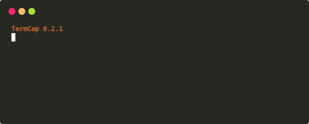

# TermCap

TermCap 将 Unix 终端会话录制为 asciicast v2，并渲染为可独立分发的 SVG 动画或 GIF。录制、重放、模板和媒体导出使用同一条时间轴，适合项目演示、操作教程和可复现的命令行记录。

<p align="center">
  <a href="examples/#reproducible-svg-gif">
    
  </a>
</p>

<p align="center"><a href="examples/#reproducible-svg-gif">查看对应的 SVG 和完整生成命令</a></p>

<div class="grid cards" markdown>

-   :material-record-circle-outline: **录制终端**

    ---

    在 PTY 子终端中记录 ANSI 输出、颜色、光标和终端尺寸，生成兼容 asciinema 的 `.cast` 文件。

    [开始录制](quickstart.md#capture-terminal)

-   :material-vector-square: **渲染 SVG**

    ---

    使用 `pyte` 重建终端状态，通过离散 CSS 关键帧生成轻量、可缩放的 SVG 动画。

    [了解渲染链路](rendering.md#cast-to-svg)

-   :material-file-gif-box: **导出 GIF**

    ---

    Chrome 后端按关键帧确定性冻结画面，自动校正 viewport，避免裁底、黑帧和大量重复帧。

    [导出 GIF](rendering.md#svg-to-gif)

-   :material-palette-outline: **模板与主题**

    ---

    内置 16 套模板，也支持自定义颜色、字体、窗口框架和交互脚本。

    [浏览模板](templates.md)

</div>

## 按场景选择

| 目标 | 推荐命令 | 继续阅读 |
|---|---|---|
| 录制交互式 shell | `termcap record demo.cast -g 80x20` | [快速开始](quickstart.md) |
| 录制单条命令 | `termcap record demo.cast -c "python demo.py"` | [录制与渲染](rendering.md) |
| CAST 转 SVG | `termcap render demo.cast demo.svg` | [CAST → SVG](rendering.md#cast-to-svg) |
| CAST 直接转 GIF | `termcap render demo.cast demo.gif --format gif` | [CAST → GIF](rendering.md#cast-to-gif) |
| 已有 SVG 转 GIF | `termcap svg2gif demo.svg demo.gif` | [SVG → GIF](rendering.md#svg-to-gif) |
| 查看全部命令 | `termcap` | [CLI 树](cli-tree.md) |

## 最短工作流

```bash
pip install termcap
termcap record demo.cast -g 80x20
termcap render demo.cast demo.svg
termcap render demo.cast demo.gif --format gif
```

!!! tip "控制空白区域"
    输出尺寸来自录制时的终端 geometry。短演示可使用 `-g 80x12` 或其他合适尺寸；TermCap 不会默认裁掉终端内部的有效行，因为全屏程序和较早帧可能使用这些区域。

## 当前能力

- asciicast v2 录制与重放
- ANSI/256 色、宽字符、光标和文本样式渲染
- 模板化 SVG 动画与静态 SVG 帧
- CAST → GIF 与 SVG → GIF
- 关键帧优先采样、GIF 时间量化与速度控制
- 内置模板 package data，可从 wheel 安装后直接使用

有关已实现能力和明确边界，参见[能力边界](capability-map.md)。
