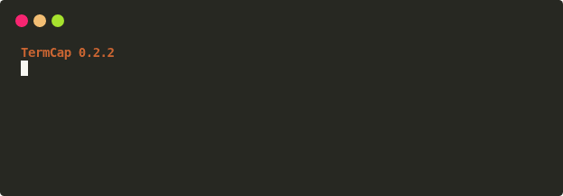

# 快速开始

<div class="grid cards" markdown>

-   **交互式录制**

    进入子 shell，自由执行多条命令，使用 `exit` 或 ++ctrl+d++ 结束。

-   **单命令录制**

    使用 `-c` 录制脚本、测试或一次性命令，命令退出后自动结束。

-   **媒体导出**

    同一个 `.cast` 可以输出 SVG、GIF 或静态 SVG 帧。

</div>

## 安装

TermCap 支持 Linux、macOS 和 BSD，需要 Python 3.8 或更高版本。GIF 导出还需要本机可用的 Google Chrome；ChromeDriver 由工具首次运行时准备并缓存。

```bash
python -m pip install termcap
termcap --version
```

## 先看完整结果

下面两张图来自同一份终端录制：先生成可缩放的动画 SVG，再从同一时间轴确定性导出 GIF。

### SVG 动画

<p align="center">
  <a href="../assets/examples/quickstart.svg">
    
  </a>
</p>

### GIF 导出

<p align="center">
  <a href="../assets/examples/quickstart.gif">
    
  </a>
</p>

[查看生成脚本和完整命令](examples/index.md#reproducible-svg-gif)

## 录制终端 { #capture-terminal }

### 交互式 shell

```bash
termcap record demo.cast -g 80x20
```

进入子 shell 后正常执行命令；完成时运行：

```bash
exit
```

### 单条命令

```bash
termcap record tests.cast -g 100x24 -c "python -m pytest -q"
```

`-c` 模式会继续读取 PTY 直到子进程退出并把剩余输出 drain 完成，适合短命令和自动化验收。

## 重放 CAST

```bash
termcap replay demo.cast
termcap replay demo.cast --speed 2
termcap replay demo.cast --idle-time-limit 2
```

## 渲染 SVG

```bash
termcap render demo.cast demo.svg
```

指定模板：

```bash
termcap render demo.cast demo.svg -t window_frame
```

输出独立静态帧：

```bash
termcap render demo.cast demo_frames --still-frames
```

## 导出 GIF

CAST 直接转 GIF：

```bash
termcap render demo.cast demo.gif --format gif
```

已有 SVG 转 GIF：

```bash
termcap svg2gif demo.svg demo.gif
```

速度和循环：

```bash
termcap svg2gif demo.svg demo-fast.gif --speed 2 --loop 0
```

TermCap SVG 含离散终端关键帧时，`--fps` 不会制造重复帧；只有普通 SVG 缺少可识别关键帧时，才使用 `--fps` 进行回退采样。

## 下一步

- [查看完整 CLI 树](cli-tree.md)
- [理解录制与渲染链路](rendering.md)
- [选择或制作模板](templates.md)
